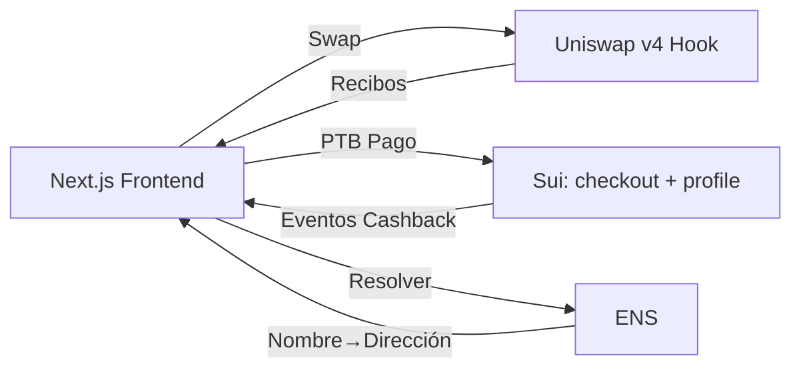
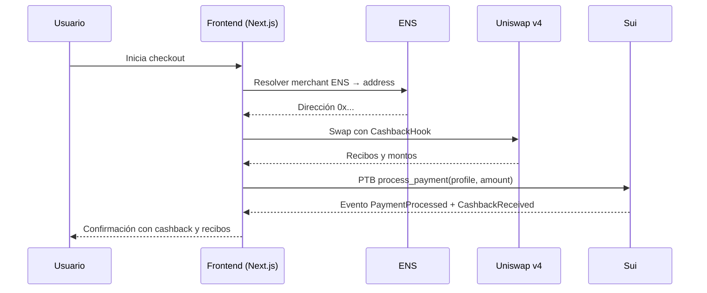

# Cashback ID 🦄💰

**A Uniswap v4 Hook for Automated Cashback Yield Generation**

**Tech Stack:** Uniswap v4 (Hooks), Sui Network (High-Speed Execution), ENS (Identity)  
**Tagline:** "Tu nombre es tu cuenta. Tu compra es tu inversión."

---

## 🚀 Deployed Contracts

### Sepolia Testnet

| Contract | Address | Status |
|----------|---------|--------|
| **CashbackHook** | [`0xE85F5b463fB5b15Cb9222Edc8c2e07e121352762`](https://sepolia.etherscan.io/address/0xE85F5b463fB5b15Cb9222Edc8c2e07e121352762) | ✅ Deployed |
| **PoolManager (Uniswap v4)** | [`0xE03A1074c86CFeDd5C142C4F04F1a1536e203543`](https://sepolia.etherscan.io/address/0xE03A1074c86CFeDd5C142C4F04F1a1536e203543) | ✅ Official |

---

## 🛠️ Quick Start

### Prerequisites
- [Foundry](https://book.getfoundry.sh/getting-started/installation)
- Node.js >= 18

### Installation

```bash
git clone https://github.com/GA-Asso/Hackmoney.git
cd Hackmoney
forge install
cp .env.example .env
```

### Build & Test

```bash
forge build
forge test -vv
```

### Deploy

```bash
source .env
forge script script/DeployCashbackHook.s.sol:DeployCashbackHook \
  --rpc-url $RPC_URL --private-key $PRIVATE_KEY --broadcast
```

---

## 🎯 How It Works

```
User Swaps → Uniswap v4 Pool → CashbackHook → Yield Pool (Auto LP)
```

1. **User swaps** tokens through a Uniswap v4 pool with CashbackHook
2. **Hook intercepts** the `afterSwap` callback
3. **Cashback calculated** based on swap volume
4. **Auto-deposit** into yield-generating liquidity pools
5. **User earns** passive yield on their cashback

---

## 📁 Project Structure

```
├── src/CashbackHook.sol       # Main Uniswap v4 Hook
├── script/DeployCashbackHook.s.sol
├── test/CashbackHook.t.sol
├── lib/v4-core/               # Uniswap v4 core
├── app/                       # Next.js frontend (WIP)
└── sui/                       # Sui contracts (WIP)
```

---

## 📜 License

MIT

---

## �� Plan de Implementación Sui

Objetivo: complementar el flujo de cashback con ejecución de alta velocidad en Sui, manteniendo el swap y la identidad en Ethereum (Uniswap v4 + ENS).

Fases:
- Fase 1: Perfil y Preferencias
  - Definir objeto `CashbackProfile` con modo, porcentaje, autocompound y tier.
  - Eventos: `ProfileCreated`, `PreferencesUpdated`, `CashbackReceived`.
- Fase 2: Checkout PTB (Programmable Transaction Blocks)
  - Módulo `checkout` con `process_payment` que calcula cashback y emite eventos.
  - Batch de pagos vía PTB para atomizar operaciones.
- Fase 3: Integración Frontend
  - Orquestar en Next.js: crear/actualizar perfil, enviar pagos PTB, leer eventos.
  - Sincronizar estado y recibos con el flujo de swap en Ethereum.
- Fase 4: Observabilidad
  - Registro de eventos y métricas de cashback/tier.
  - Pruebas unitarias y de integración en `sui/tests`.

Quickstart Sui:
```bash
# Requisitos: Sui CLI instalado
cd sui
sui move build
sui move test
```

---

## 🔗 Enlace de Protocolos (ENS + Sui + Uniswap)

- Identidad (ENS):
  - Resolución de nombre ↔ dirección del usuario/merchant en Ethereum.
  - Se usa en la UI y en recibos del swap.
- Ejecución de pagos (Sui):
  - PTB `process_payment` calcula y persiste cashback/tier del usuario.
  - Emite eventos para UI y analítica.
- Liquidez y precios (Uniswap v4):
  - Swap principal y hook `CashbackHook.sol` para lógica de cashback en L1/L2 EVM.
  - Los montos y recibos se sincronizan con el perfil en Sui.

---

## 🗺️ Arquitectura





---

## ✅ Estados y Datos Clave
- Perfil: modo, % cashback, autocompound, tier.
- Pagos: amount, merchant, cashback calculado.
- Eventos: trazabilidad completa para UI/analytics.

---

## 📌 Notas
- No se expone el Gateway públicamente; usar Tailscale/SSH para acceso seguro.
- Mantener sincronización entre recibos EVM y perfil Sui a nivel de UI.
- Añadir pruebas en `test/` (Foundry) y `sui/tests` para validar invariantes.

